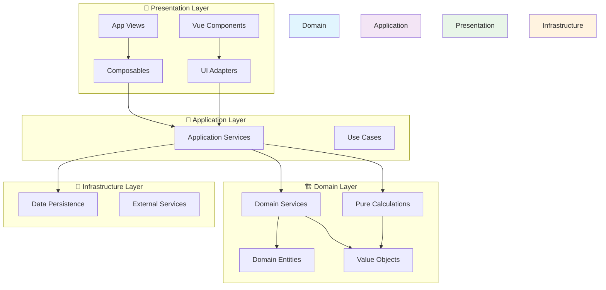
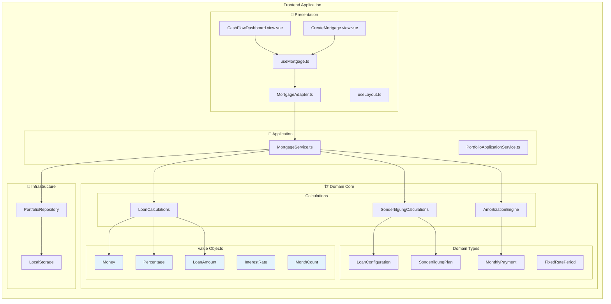
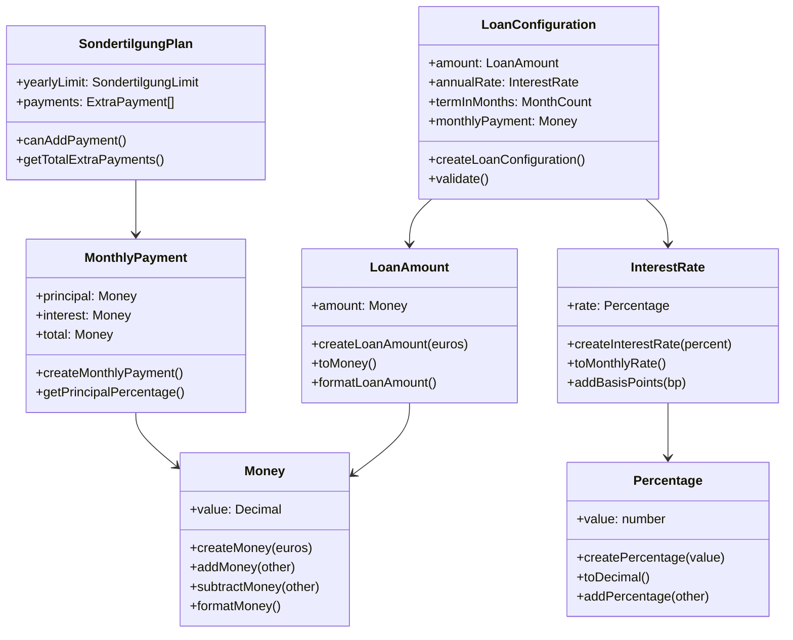
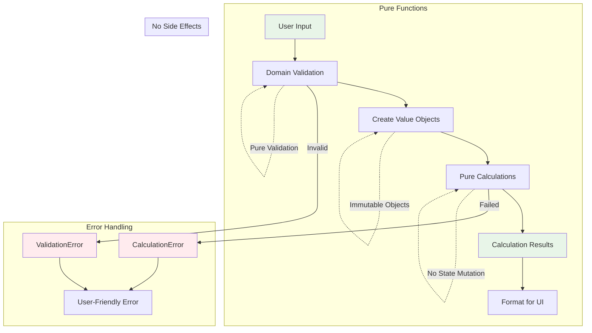
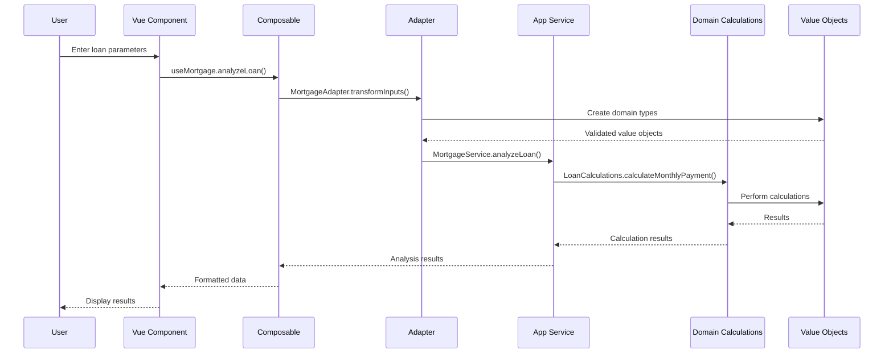

# Grundstein Architecture

## Overview

Grundstein is a **sophisticated mortgage portfolio management solution** built with **Domain-Driven Design** and **functional programming** principles. Despite having a simple UI, it features enterprise-level domain modeling with comprehensive type safety and financial calculation capabilities.

## Architecture Pattern: Clean Architecture + DDD

The application follows Clean Architecture with Domain-Driven Design, ensuring business logic independence from UI and infrastructure concerns.



## Detailed System Architecture



## Domain Model Deep Dive



## Functional Programming Flow



## File Structure

```
src/
├── 🎨 App.vue                     # Root Vue component
├── 🎨 app/                        # Application Layer
│   ├── adapters/                  # UI to Domain adapters
│   │   └── MortgageAdapter.ts     # Convert UI inputs to domain types
│   ├── composables/               # Vue composition functions
│   │   ├── useMortgage.ts         # Mortgage calculation composable
│   │   └── useLayout.ts           # Layout utilities
│   ├── services/application/      # Application services
│   │   └── services/
│   │       └── MortgageService.ts # Orchestrates domain operations
│   └── views/                     # Vue page components
│       ├── CashFlowDashboard.view.vue
│       └── CreateMortgage.view.vue
├── 🏗️ core/                       # Domain + Infrastructure
│   ├── domain/                    # Domain Layer (Pure Business Logic)
│   │   ├── calculations/          # Pure calculation functions
│   │   │   ├── LoanCalculations.ts
│   │   │   ├── SondertilgungCalculations.ts
│   │   │   └── AmortizationEngine.ts
│   │   ├── primitives/            # Brand utility and base types
│   │   │   ├── Brand.ts
│   │   │   └── GermanSondertilgungRules.ts
│   │   ├── types/                 # Domain aggregate types
│   │   │   ├── LoanConfiguration.ts
│   │   │   ├── MonthlyPayment.ts
│   │   │   ├── SondertilgungPlan.ts
│   │   │   └── FixedRatePeriod.ts
│   │   └── value-objects/         # Branded value objects
│   │       ├── Money.ts
│   │       ├── Percentage.ts
│   │       ├── LoanAmount.ts
│   │       ├── InterestRate.ts
│   │       └── MonthCount.ts
│   └── infrastructure/            # Infrastructure Layer
├── 🔧 router/                     # Vue Router configuration
├── 🔧 stores/                     # Pinia state management
├── 🔧 services/                   # External services
└── 🔧 utils/                      # Utilities (logging, performance)
```

## Data Flow Architecture



## Key Architectural Principles

### 1. **Domain-Driven Design**

- Business logic isolated in domain layer
- Rich domain model with value objects
- Ubiquitous language throughout codebase

### 2. **Functional Programming**

- Pure functions for all calculations
- Immutable data structures
- No classes in business logic
- Result/Option types for error handling

### 3. **Type Safety**

- Branded types prevent primitive obsession
- Business rules encoded at type level
- Comprehensive validation with proper error types

### 4. **Clean Architecture**

- Dependency inversion (domain ← application ← UI)
- Business logic independent of frameworks
- Infrastructure concerns separated

### 5. **German Market Focus**

- Sondertilgung (extra payment) rules
- BaFin compliance considerations
- German banking terminology and calculations

## Testing Strategy

```mermaid
pyramid
    title Testing Strategy
    ["E2E Tests" : 5] : "Browser tests for user journeys"
    ["Integration Tests" : 15] : "Service layer integration"
    ["Unit Tests (400+)" : 80] : "Domain logic validation"
```

- **400+ Unit Tests** - All domain types and calculations
- **Property-Based Testing** - Mathematical invariants with fast-check
- **Real-World Validation** - German mortgage scenarios
- **Type Safety** - Compile-time error prevention

## Technology Stack

| Layer            | Technologies                                |
| ---------------- | ------------------------------------------- |
| **Frontend**     | Vue 3, TypeScript, Composition API          |
| **Build**        | Vite, Rolldown (cutting-edge bundler)       |
| **Testing**      | Vitest, Property-based testing (fast-check) |
| **Quality**      | Oxlint, TypeScript strict mode, Git hooks   |
| **Calculations** | Decimal.js for financial precision          |
| **State**        | Pinia, Local component state                |

## Performance Characteristics

- **Fast Tests**: 400+ tests run in ~3 seconds
- **Type Safety**: Compile-time error prevention
- **Mathematical Precision**: Decimal.js prevents floating-point errors
- **Memory Efficient**: Immutable data with minimal overhead
- **Bundle Size**: Optimized with Rolldown bundler

## Future Extension Points

The architecture supports future expansion:

1. **Multi-Market Support** - Architecture ready for other countries
2. **Complex Portfolio Management** - Domain model can handle multiple properties
3. **Advanced Analytics** - Pure calculation functions enable easy feature addition
4. **External Integrations** - Clean infrastructure layer for APIs
5. **Real-Time Updates** - Reactive architecture supports live data

---

_This architecture balances sophisticated domain modeling with practical implementation, ensuring both business logic correctness and development productivity._
