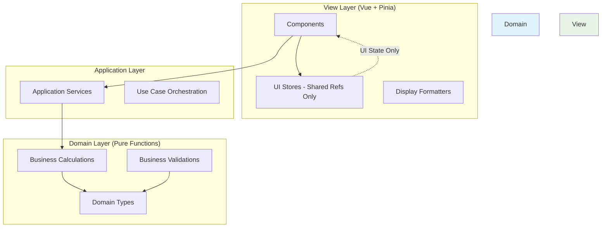
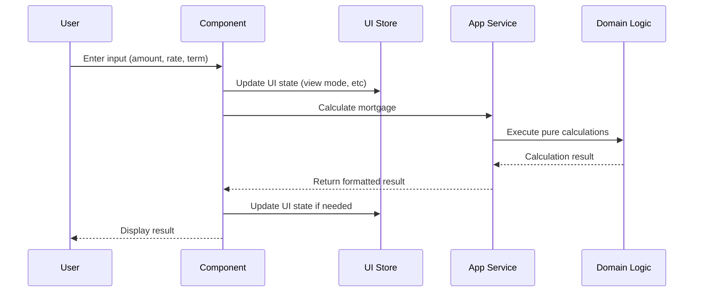
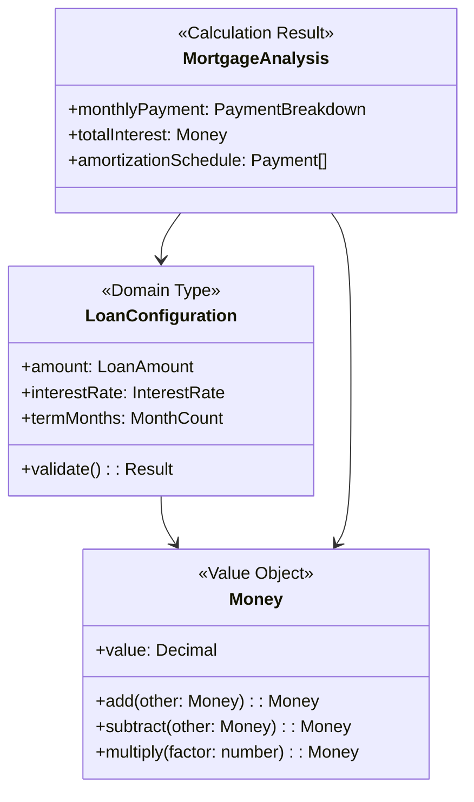

# Grundstein Architecture

## Overview

Grundstein is a **sophisticated mortgage calculation engine** built with **pure functional architecture** where business logic is completely isolated from the view layer. Vue/Pinia serves exclusively as the presentation layer with no business logic.

## Core Architecture Principles

### 1. **Strict Layer Separation**

- **Domain Layer**: All business logic, calculations, and rules (pure functions)
- **View Layer**: Only UI state and display concerns (Vue + Pinia)
- **No Logic in View**: Stores are just shared refs and computed values

### 2. **Pure Functional Core**

- All business logic as pure functions
- No classes in domain layer
- Immutable data structures
- Result/Option types for error handling

### 3. **Stores as Shared Refs**

- Pinia stores contain ONLY UI state
- No business logic in stores
- No domain types in stores
- Just lifted component state

## Architecture Layers



## Correct Data Flow



## What Goes Where

### Domain Layer (`src/core/domain/`)

```typescript
// ✅ CORRECT - Pure business logic
export function calculateMonthlyPayment(
  config: LoanConfiguration,
): Result<PaymentBreakdown, CalculationError> {
  // Pure calculation logic
  const monthlyRate = config.interestRate / 12 / 100;
  const payment = calculatePayment(config.amount, monthlyRate, config.months);
  return Result.ok({
    principal: payment.principal,
    interest: payment.interest,
  });
}

// ✅ CORRECT - Business validation
export function validateLoanAmount(
  amount: number,
): Result<LoanAmount, ValidationError> {
  if (amount < 10000) return Result.error("Minimum loan amount is €10,000");
  if (amount > 5000000)
    return Result.error("Maximum loan amount is €5,000,000");
  return Result.ok(createLoanAmount(amount));
}
```

### Application Layer (`src/core/application/`)

```typescript
// ✅ CORRECT - Orchestration only
export async function createMortgageWithAnalysis(
  input: CreateMortgageInput,
  repository: MortgageRepository,
): Promise<Result<MortgageWithAnalysis, Error>> {
  // Validate input using domain function
  const validationResult = validateMortgageInput(input);
  if (!validationResult.success) return validationResult;

  // Create mortgage using domain function
  const mortgage = createMortgage(validationResult.data);

  // Analyze using domain function
  const analysis = analyzeMortgage(mortgage);

  // Persist via repository
  await repository.save(mortgage);

  return Result.ok({ mortgage, analysis });
}
```

### View Layer - UI Stores (`src/app/stores/`)

```typescript
// ✅ CORRECT - UI state only
export const useMortgageUIStore = defineStore("mortgage-ui", () => {
  // Shared refs - UI state only
  const selectedMortgageId = ref<string | null>(null);
  const viewMode = ref<"grid" | "list">("grid");
  const isSidebarOpen = ref(false);
  const sortField = ref<"date" | "amount">("date");

  // Shared computed - UI derivations only
  const hasSelection = computed(() => selectedMortgageId.value !== null);

  return {
    selectedMortgageId,
    viewMode,
    isSidebarOpen,
    sortField,
    hasSelection,
    // Simple setters only
    selectMortgage: (id: string | null) => (selectedMortgageId.value = id),
    setViewMode: (mode: typeof viewMode.value) => (viewMode.value = mode),
  };
});
```

### Composables (`src/app/composables/`)

```typescript
// ✅ CORRECT - Calculation composables
export function useMortgageCalculator() {
  const inputs = reactive({
    loanAmount: "",
    interestRate: "",
    termYears: "",
  });

  const result = computed(() => {
    const amount = parseFloat(inputs.loanAmount);
    const rate = parseFloat(inputs.interestRate);
    const years = parseInt(inputs.termYears);

    if (isNaN(amount) || isNaN(rate) || isNaN(years)) return null;

    // Direct call to domain function
    return MortgageCalculationService.calculate({ amount, rate, years });
  });

  return { inputs, result };
}
```

### Components (`src/app/components/`)

```typescript
// ✅ CORRECT - Component using all layers properly
<script setup lang="ts">
// UI State
const uiStore = useMortgageUIStore()
const { selectedMortgageId, viewMode } = storeToRefs(uiStore)

// Direct calculation
const { inputs, result } = useMortgageCalculator()

// Pure domain calculations in computed
const mortgageAnalysis = computed(() => {
  if (!result.value) return null
  // Call pure domain function
  return analyzeMortgage(result.value) // Domain function
})

// UI-only formatting
const displayMortgages = computed(() =>
  analyzedMortgages.value.map(formatForDisplay)
)
</script>
```

## Anti-Patterns to Avoid

### ❌ Business Logic in Stores

```typescript
// WRONG - Store contains business logic
export const useBadStore = defineStore("bad", () => {
  const mortgages = ref<Mortgage[]>([]);

  // ❌ Calculation in store
  const totalAmount = computed(() =>
    mortgages.value.reduce((sum, m) => sum + m.amount, 0),
  );

  // ❌ Business logic in store
  const addMortgage = (input: MortgageInput) => {
    const validated = validateMortgage(input); // ❌ Validation
    const mortgage = createMortgage(validated); // ❌ Domain logic
    mortgages.value.push(mortgage);
  };
});
```

### ❌ Async Operations in Stores

```typescript
// WRONG - Store pretending to be async
export const useBadStore = defineStore("bad", () => {
  const isCalculating = ref(false); // ❌ Calculations are synchronous

  const calculateAsync = async () => {
    isCalculating.value = true; // ❌ Fake async
    await new Promise((r) => setTimeout(r, 1000)); // ❌ Artificial delay
    const result = calculate(); // ❌ Just call directly
    isCalculating.value = false;
  };
});
```

## Domain Model



## File Structure

```
src/
├── core/                         # Business Logic (No Vue/UI code)
│   ├── domain/                   # Pure domain layer
│   │   ├── types/               # Domain types
│   │   ├── calculations/        # Business calculations
│   │   ├── validations/         # Business rules
│   │   └── index.ts            # Public API
│   └── application/             # Use case orchestration
│       └── services/            # Application services
│
└── app/                        # View Layer (Vue/UI only)
    ├── stores/                 # UI state only
    │   ├── mortgageUIStore.ts  # UI state: selections, view modes
    │   └── layoutUIStore.ts    # UI state: sidebar, modals
    ├── components/             # Vue components
    ├── composables/            # Vue composables
    └── pages/                  # Page components
```

## Testing Strategy

### Domain Layer Tests

```typescript
// Pure function tests - easy to test
describe("calculateMonthlyPayment", () => {
  it("should calculate correct payment", () => {
    const config = createLoanConfiguration(300000, 3.5, 360);
    const result = calculateMonthlyPayment(config);
    expect(result.success).toBe(true);
    expect(result.data.total).toBe(1347.13);
  });
});
```

### UI Store Tests

```typescript
// UI state tests - no business logic
describe("mortgageUIStore", () => {
  it("should update selection", () => {
    const store = useMortgageUIStore();
    store.selectMortgage("123");
    expect(store.selectedMortgageId).toBe("123");
    expect(store.hasSelection).toBe(true);
  });
});
```

## Benefits of This Architecture

1. **Clear Separation**: Business logic never leaks into UI
2. **Testability**: Pure functions are trivial to test
3. **Reusability**: Domain logic can be used anywhere
4. **Type Safety**: Domain types ensure correctness
5. **Performance**: TanStack Query handles caching
6. **Maintainability**: Changes are isolated to layers

## Summary

- **Domain Layer**: All business logic as pure functions
- **Application Layer**: Orchestration and use cases
- **View Layer**: Vue + Pinia for UI state only
- **Stores = Shared Refs**: Nothing more than lifted component state
- **In-Memory Calculator**: No network, no persistence, pure calculations

This architecture ensures that business logic remains pure, testable, and completely independent of the UI framework. Perfect for a mortgage calculator that runs entirely in the browser.
