# Grundstein Architecture

## Overview

Grundstein is a **sophisticated mortgage calculation engine** built with **Domain-Driven Design** and **functional programming** principles. It's a pure calculator that transforms user inputs into precise financial calculations without any data persistence.

## Architecture Pattern: Functional Domain-Driven Design

The application follows a simplified 3-layer architecture focused on pure calculations and type safety.


## Actual System Architecture

```mermaid
graph LR
    subgraph "Frontend Application"
        subgraph "🎨 Presentation"
            V1[CashFlowDashboard.view.vue]
            V2[CreateMortgage.view.vue]
            C1[useMortgage.ts]
            C2[useLayout.ts]
            A1[MortgageAdapter.ts]
            STORE[mortgageStore.ts]
        end

        subgraph "🚀 Application"
            MS[MortgageService.ts]
        end

        subgraph "🏗️ Domain Core"
            subgraph "Value Objects"
                VO1[Money]
                VO2[Percentage]
                VO3[LoanAmount]
                VO4[InterestRate]
                VO5[MonthCount]
            end

            subgraph "Domain Types"
                DT1[LoanConfiguration]
                DT2[MonthlyPayment]
                DT3[SondertilgungPlan]
                DT4[FixedRatePeriod]
            end

            subgraph "Calculations"
                CALC1[LoanCalculations]
                CALC2[SondertilgungCalculations]
                CALC3[AmortizationEngine]
            end
        end
    end

    V1 --> C1
    V2 --> C1
    C1 --> STORE
    C1 --> A1
    A1 --> MS
    MS --> CALC1
    MS --> CALC2
    MS --> CALC3
    CALC1 --> VO1
    CALC1 --> VO2
    CALC1 --> VO3
    CALC2 --> DT1
    CALC2 --> DT3
    CALC3 --> DT2

    style VO1 fill:#e3f2fd
    style VO2 fill:#e3f2fd
    style VO3 fill:#e3f2fd
    style VO4 fill:#e3f2fd
    style VO5 fill:#e3f2fd
```



## Domain Model Deep Dive


## Pure Functional Data Flow


## Actual File Structure

```
src/
├── 🎨 App.vue                     # Root Vue component
├── 🎨 app/                        # Application Layer
│   ├── adapters/                  # UI to Domain adapters
│   │   └── MortgageAdapter.ts     # Convert UI inputs to domain types
│   ├── composables/               # Vue composition functions
│   │   ├── useMortgage.ts         # Mortgage calculation composable
│   │   └── useLayout.ts           # Layout utilities
│   ├── services/application/      # Application services
│   │   └── services/
│   │       └── MortgageService.ts # Orchestrates domain operations
│   └── views/                     # Vue page components
│       ├── CashFlowDashboard.view.vue
│       └── CreateMortgage.view.vue
├── 🏗️ core/domain/                # Domain Layer (Pure Business Logic)
│   ├── calculations/              # Pure calculation functions
│   │   ├── LoanCalculations.ts
│   │   ├── SondertilgungCalculations.ts
│   │   └── AmortizationEngine.ts
│   ├── primitives/                # Brand utility and base types
│   │   ├── Brand.ts
│   │   └── GermanSondertilgungRules.ts
│   ├── types/                     # Domain aggregate types
│   │   ├── LoanConfiguration.ts
│   │   ├── MonthlyPayment.ts
│   │   ├── SondertilgungPlan.ts
│   │   └── FixedRatePeriod.ts
│   └── value-objects/             # Branded value objects
│       ├── Money.ts
│       ├── Percentage.ts
│       ├── LoanAmount.ts
│       ├── InterestRate.ts
│       └── MonthCount.ts
├── 🔧 router/                     # Vue Router configuration
├── 🔧 stores/                     # Pinia state management (UI state only)
├── 🔧 services/                   # Data services (in-memory)
└── 🔧 utils/                      # Utilities (logging, performance)
```

## Data Flow Architecture


## Key Architectural Principles

### 1. **Pure Calculator Architecture**

- No data persistence - stateless calculations only
- Results computed fresh for each user interaction
- No storage concerns - minimal infrastructure needs

### 2. **Domain-Driven Design**

- Business logic isolated in domain layer
- Rich domain model with value objects
- Ubiquitous language throughout codebase

### 3. **Functional Programming**

- Pure functions for all calculations
- Immutable data structures
- No classes in business logic
- Result/Option types for error handling

### 4. **Type Safety First**

- Branded types prevent primitive obsession
- Business rules encoded at type level
- Comprehensive validation with proper error types

### 5. **German Market Focus**

- Sondertilgung (extra payment) rules
- BaFin compliance considerations
- German banking terminology and calculations

## What This App Actually Does

### **Core Functionality**

- **Single Mortgage Calculator** - Input loan parameters, get payment calculations
- **German Sondertilgung Analysis** - Extra payment scenarios and savings
- **Amortization Schedules** - Payment breakdowns over time
- **Interest Rate Sensitivity** - What-if analysis for rate changes

### **User Journey**

1. **Input**: Loan amount, interest rate, term, monthly payment
2. **Calculate**: Domain engine performs financial calculations
3. **Display**: Results shown with charts and tables
4. **Analyze**: Different scenarios and extra payment options
5. **No Saving**: Results are temporary, no persistence needed

## Testing Strategy

```mermaid
pyramid
    title Testing Strategy (No Integration Tests Needed)
    ["Component Tests" : 10] : "UI interaction testing"
    ["Unit Tests (400+)" : 90] : "Domain logic validation"
```

- **400+ Unit Tests** - All domain types and calculations
- **Property-Based Testing** - Mathematical invariants with fast-check
- **Real-World Validation** - German mortgage scenarios
- **Type Safety** - Compile-time error prevention
- **No Integration Tests** - No external systems to integrate with

## Technology Stack

| Layer            | Technologies                                 | Purpose               |
| ---------------- | -------------------------------------------- | --------------------- |
| **Frontend**     | Vue 3, TypeScript, Composition API           | User interface        |
| **State**        | Pinia (UI state only), Local component state | Temporary state       |
| **Build**        | Vite, Rolldown (cutting-edge bundler)        | Fast development      |
| **Testing**      | Vitest, Property-based testing (fast-check)  | Quality assurance     |
| **Quality**      | Oxlint, TypeScript strict mode, Git hooks    | Code quality          |
| **Calculations** | Decimal.js for financial precision           | Mathematical accuracy |

## Performance Characteristics

- **Fast Tests**: 400+ tests run in ~3 seconds
- **Instant Calculations**: No database/API delays
- **Type Safety**: Compile-time error prevention
- **Mathematical Precision**: Decimal.js prevents floating-point errors
- **Memory Efficient**: Immutable data with minimal overhead
- **Small Bundle**: No database/persistence libraries needed

## Why No Infrastructure Layer?

### **Design Decision: Stateless Calculator**

- **No User Accounts** - Anonymous usage
- **No Data Storage** - Results are temporary
- **No External APIs** - Self-contained calculations
- **No Persistence** - Fresh calculations each time

### **Benefits of This Approach**

- **Privacy First** - No data collection or storage
- **Simple Deployment** - Static hosting, no backend needed
- **Fast Performance** - No database queries
- **Easy Testing** - No external dependencies
- **Maintenance** - Fewer moving parts to break

### **When Infrastructure Would Be Needed**

Future features that would require infrastructure:

- User accounts and saved calculations
- Portfolio management across multiple loans
- Historical data and trends
- External API integrations (bank rates, property values)
- Multi-user collaboration

## Future Extension Points

The architecture supports adding infrastructure later if needed:

1. **User Accounts** - Add authentication and user-specific data
2. **Data Persistence** - Save calculations and portfolios
3. **External APIs** - Real-time interest rates, property valuations
4. **Advanced Analytics** - Historical trends and market analysis
5. **Multi-Market Support** - Additional country-specific rules

---

_This architecture prioritizes simplicity and mathematical correctness over complex data management, perfectly suited for a sophisticated financial calculator._
